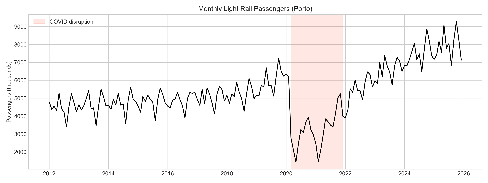
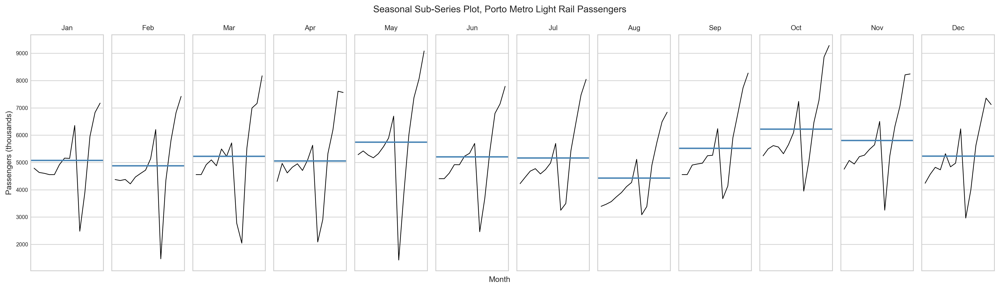
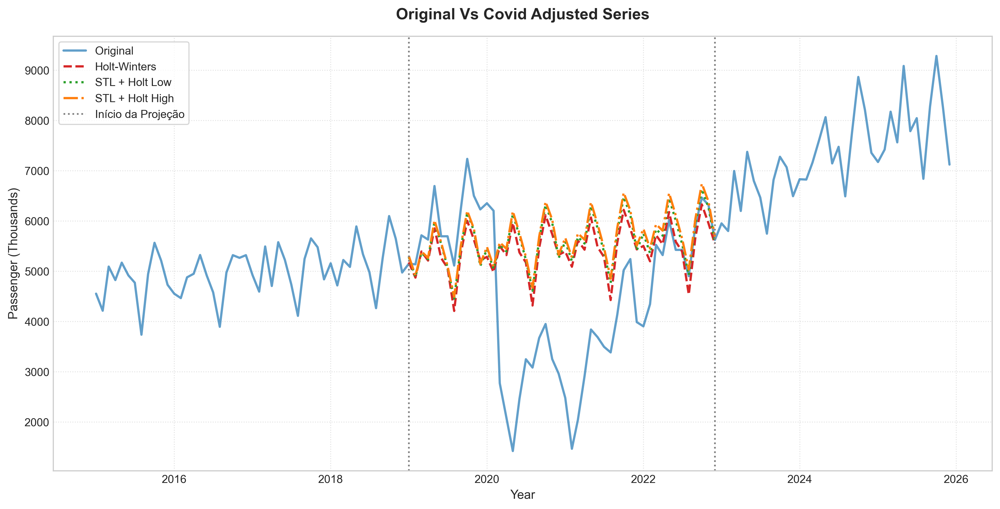
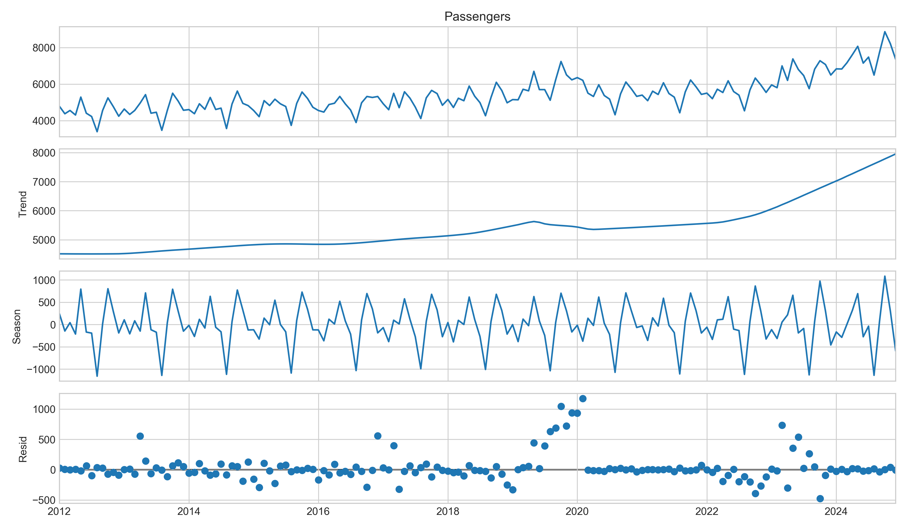
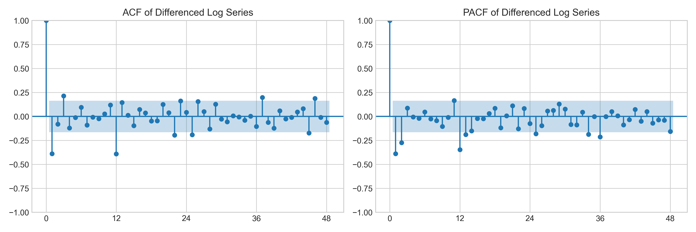
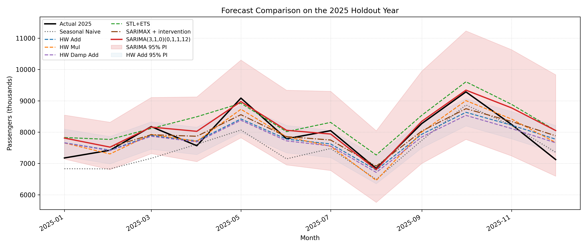
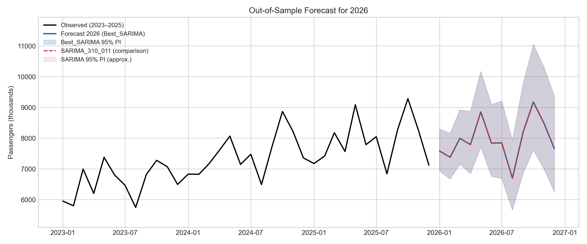
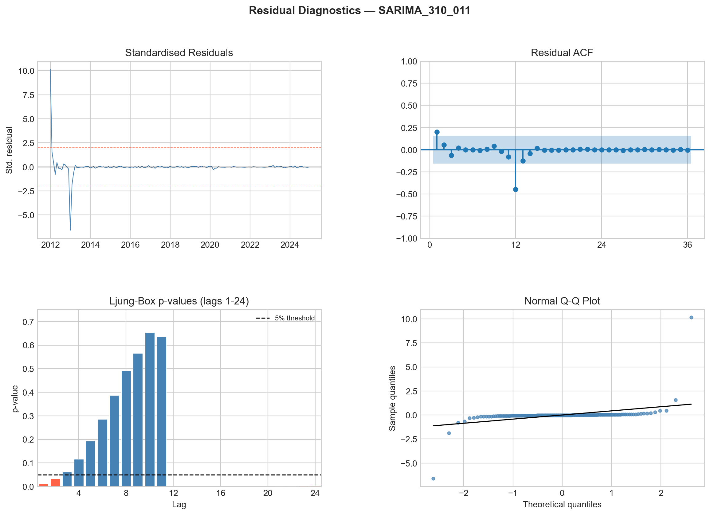
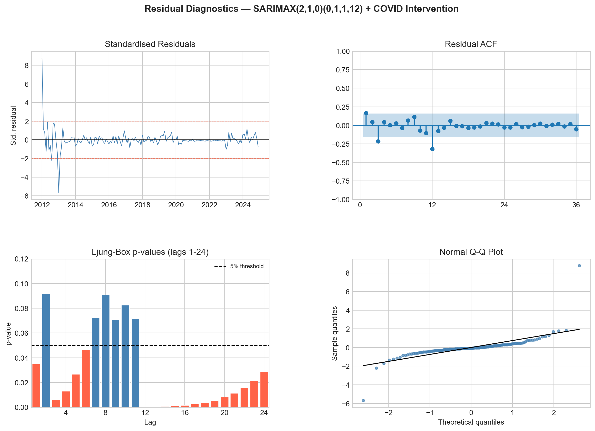

# Light Rail Passenger Forecasting for Porto Metro (2012-2026)

## Abstract
This report forecasts monthly light rail passenger demand for Porto Metro using smoothing models, decomposition-based forecasting, SARIMA, and a SARIMAX intervention specification. The analysis uses 168 monthly observations from January 2012 to December 2025, measured in thousands of passengers. The sample begins in 2012 because the earlier 2004-2011 ramp-up period reflects network expansion rather than a mature demand process and materially degrades residual diagnostics. A leakage-free design is used throughout: models are trained on January 2012 to December 2024, evaluated on the 12 observed months of 2025, and only then re-estimated to produce forecasts for 2026. On the 2025 holdout, the selected model is `SARIMA(3,1,0)(0,1,1,12)`, which achieves the lowest MAPE (`3.66%`) and the lowest MASE (`0.572`). The implied 2026 total is `95,479` thousand passengers, only `0.5%` above the 2025 total, which suggests that the strong post-COVID recovery has largely stabilised.

## 1. Introduction
The goal of this project is to produce and compare forecasts for Porto Metro monthly passenger demand, then use the best-supported method to generate an out-of-sample forecast for 2026. This is a suitable forecasting problem because the series combines a clear trend, strong seasonality at a monthly frequency, changing variance, and a large exogenous shock. Those features make it useful for comparing methods with different strengths.

The report follows the logic required for time-series forecasting. It begins by describing the data and the features of the series, then applies smoothing methods, decomposition methods, and SARIMA modelling. The competing approaches are compared on a genuine holdout year, and the final forecast is produced only after model selection is completed.

## 2. Data, Scope and Evaluation Design

### 2.1 Data Source and Variable
The data are monthly light rail passenger counts for Porto Metro, measured in thousands of passengers and sourced from Statistics Portugal (INE). The available file originally covered January 2004 to December 2025, but the modelling sample used in this report starts in January 2012.

The 2004-2011 observations were excluded deliberately rather than mechanically. During those years the Porto Metro network was still expanding, so ridership was increasing partly because the transport system itself was changing. That early-adoption phase is not representative of the mature demand process that the 2026 forecast is trying to capture. Diagnostic checks on models estimated with earlier starting points showed that the 2010-2011 segment inflated residual dispersion dramatically and induced spurious autocorrelation. Starting in 2012 therefore improves both interpretability and statistical stability.

### 2.2 Data Preparation
The preparation pipeline was:

1. Parse month-year strings into a monthly time index.
2. Sort the observations chronologically and enforce monthly frequency.
3. Convert the series to numeric values.
4. Repair invalid observations.
5. Split the series chronologically into training and validation periods.

Only one value needed repair: a single zero observation was replaced by time interpolation. No missing values remained after cleaning.

| Item | Value |
|---|---:|
| Start date | 2012-01-01 |
| End date | 2025-12-01 |
| Total observations | 168 |
| Mean | 5,295.15 |
| Standard deviation | 1,445.88 |
| Minimum | 1,423 |
| Maximum | 9,284 |
| Missing values after repair | 0 |
| Duplicate timestamps | 0 |

The minimum value occurs in May 2020 and is a genuine COVID trough rather than a data-entry error. This matters because it confirms that the structural break is part of the observed demand process and not an artefact of preprocessing.

### 2.3 Train-Test Split
The split is fully chronological.

| Split | Period | Observations | Role |
|---|---|---:|---|
| Training | 2012-01 to 2024-12 | 156 | Model estimation |
| Validation | 2025-01 to 2025-12 | 12 | Model comparison |
| Forecast horizon | 2026-01 to 2026-12 | 12 | Out-of-sample forecast |

Random splitting would be invalid here because it would allow future information to leak into model fitting. The 2025 holdout is a realistic simulation of the forecasting problem: predict one full future seasonal cycle using only earlier data.

## 3. Features of the Time Series

*Figure 1. Monthly passenger series with the COVID disruption highlighted.*

Figure 1 shows four features that drive the modelling strategy.

First, the series has a strong long-run upward movement. Passenger demand in the early part of the retained sample is mostly between four and five million passengers per month, while the final years are much higher. The new sample maximum is `9,284` thousand passengers in October 2025.

Second, the series is clearly seasonal. The pattern is not random month-to-month noise; it repeats across years in a recognisable way.

Third, the seasonal pattern has an intuitive domain interpretation.

*Figure 2. Seasonal subseries plot of Porto Metro demand.*

August is the persistent trough, while October is the peak and May is a secondary high point. The figure also shows that this within-year pattern is repeated with relatively little distortion outside the COVID window. This is exactly the kind of regular seasonality that smoothing and seasonal ARIMA models are designed to exploit.

Fourth, the series contains a major structural break caused by COVID-19. The disruption runs from March 2020 to December 2022, covering 34 months, which is about 22% of the post-2012 modelling sample. The May 2020 trough is far below the rest of the series, and even after the first lockdown the recovery was gradual rather than immediate. This matters because standard univariate models assume some degree of continuity in the data-generating process; the COVID period violates that assumption.

The series also shows changing variance. Absolute month-to-month swings are larger in the high-ridership years than in the earlier years. That makes a log transformation sensible for SARIMA estimation, because modelling percentage-type changes is more appropriate than modelling fixed absolute increments when the level itself is rising.

## 4. COVID Adjustment Before Smoothing

The COVID period cannot simply be ignored, but neither should it be treated as if it were a normal demand regime. Mobility restrictions were an external intervention rather than a change in the underlying seasonal demand mechanism. When Holt-Winters models are fitted directly to the raw disrupted series, the optimiser tends to collapse onto boundary solutions that freeze the trend and seasonal updates. That is a sign that the model is trying to explain an exogenous shock with a structure that was never designed for it.

For that reason, three counterfactual series were built for the disruption window from March 2020 to December 2022:

1. `series_hw`: the COVID window is replaced by a Holt-Winters counterfactual.
2. `series_stl_low`: the COVID window is replaced by an STL + Holt counterfactual with low smoothing.
3. `series_stl_high`: the COVID window is replaced by an STL + Holt counterfactual with higher smoothing.

*Figure 3. Original series and the three COVID-adjusted counterfactual variants.*

The adjusted series are not used to hide the COVID shock. Their role is narrower and more defensible: they provide a stable learning signal for models whose internal state equations would otherwise be distorted by the intervention period. Validation still uses the original observed 2025 values, so model accuracy is always assessed on real data rather than synthetic replacements.

In the final pipeline, `series_hw` is the canonical training series for the main smoothing, decomposition, and SARIMA workflow, while `series_stl_low` is also used for the multiplicative Holt-Winters specification because it produced a better-behaved seasonal scaling.

## 5. Smoothing Methods

### 5.1 Why Smoothing Models Make Sense Here
Smoothing models are appropriate for this dataset because monthly metro demand combines a smooth level, a persistent seasonal cycle, and relatively little short-run irregular noise outside the COVID period. They are also operationally appealing: each component has a direct interpretation, which matters in a planning setting.

Three Holt-Winters variants were fitted, plus a Seasonal Naive benchmark:

1. Seasonal Naive: repeats the same month from one year earlier.
2. Holt-Winters additive (`HW_Add`): suitable if the seasonal effect is roughly constant in absolute size.
3. Holt-Winters multiplicative (`HW_Mul`): suitable if the seasonal amplitude scales with the level.
4. Holt-Winters damped additive (`HW_Damp_Add`): suitable if the recovery trend is present but expected to flatten.

These are not arbitrary choices. The EDA suggests that both additive and multiplicative arguments are plausible: the STL seasonal factors remain similar in absolute size, but the raw series also shows larger absolute swings as the level rises. Testing both is therefore more honest than assuming one seasonal form without evidence.

### 5.2 Estimation Results

| Method | alpha | beta | gamma | phi | SSE |
|---|---:|---:|---:|---:|---:|
| HW_Add | 0.5606 | 0.0000 | 0.0000 | - | 7,712,271.39 |
| HW_Mul | 0.4582 | 0.0000 | 0.0000 | - | 8,406,751.93 |
| HW_Damp_Add | 0.5648 | 0.0000 | 0.0000 | 0.9950 | 7,817,706.53 |

These estimates deserve interpretation rather than blind reporting.

The level smoothing parameters (`alpha`) are moderate, which means the fitted level responds to recent observations but does not simply copy them. That is reasonable for a monthly demand series whose underlying level changes gradually rather than abruptly.

The more important result is that all three Holt-Winters variants return `beta = 0` and `gamma = 0`. These are boundary solutions. A zero `beta` means that the trend component is set at initialisation and then never updated. A zero `gamma` means that the seasonal factors are also fixed after initialisation. In other words, even after COVID adjustment, the optimiser still prefers a very rigid structure.

That does not automatically invalidate the point forecasts, because a rigid seasonal template can still work well if the seasonal pattern is genuinely stable. However, it does limit what can be claimed about the model dynamics. The smoothing models are forecasting mainly by extrapolating a fixed seasonal pattern around a level path, not by learning an actively evolving trend and seasonality.

The damped model was included because the post-COVID surge appears less steep in 2024-2025 than in 2022-2023. If growth had clearly plateaued, damping could have been beneficial. The validation results below show that this was not the case over the 2025 holdout.

## 6. Decomposition Methods

### 6.1 STL Decomposition
STL decomposition is used because it makes the structure of the series explicit. Instead of treating the data as one opaque signal, it separates the observed series into trend-cycle, seasonal, and irregular components. That is valuable here for two reasons. First, it allows the seasonal pattern to be inspected directly. Second, it reveals whether the COVID-related volatility is concentrated in the remainder rather than contaminating the long-run structure.

STL is fitted to the training series with `period = 12` and `robust = True`. The robust option matters because the transition into and out of the counterfactual COVID window can still generate edge outliers. A classical decomposition would treat those points too literally.

*Figure 4. STL decomposition of the training series.*

The decomposition supports the modelling choices made earlier.

The seasonal component is clearly additive. August has the largest negative seasonal effect (`-1,087`), while October has the largest positive effect (`+783`) and May is another strong positive month (`+630`). These are stable, interpretable seasonal effects rather than random spikes.

The seasonal variation is also materially larger than the irregular variation. Across the training sample, the seasonal component has a standard deviation of about `466` thousand passengers, while the remainder has a standard deviation of about `243` thousand. That matters because it means a large share of the predictable variation is seasonal and therefore forecastable.

The seasonally adjusted series is obtained by subtracting the seasonal component from the observed series. This transformation is analytically useful because it isolates the underlying level and trend. Annex B reports the full decomposition from 2012 to 2025 so that the seasonal adjustment remains transparent rather than hidden inside the modelling steps.

### 6.2 Decomposition-Based Forecast: STL + Holt
Decomposition is not only descriptive here; it is also used as a forecasting method. The procedure is:

1. Decompose the training series with STL.
2. Remove the seasonal component to create a seasonally adjusted series.
3. Fit Holt's linear method to the adjusted series.
4. Forecast the adjusted series 12 months ahead.
5. Reconstruct the final forecast by adding back the last 12 seasonal factors.

This approach is appropriate when the seasonal pattern is stable and the main modelling challenge is the trend in the seasonally adjusted series. It is less appropriate when the recent trend slope near the forecast origin is misleading.

That limitation matters here. The strong 2022-2023 recovery was still visible near the end of the training sample, so the Holt component extrapolated too much momentum into 2025. The resulting `STL_ETS` model underperformed the alternatives on the holdout, as shown later.

## 7. SARIMA Modelling

### 7.1 Why SARIMA Is a Serious Candidate
SARIMA is appropriate for this dataset because the EDA shows persistent autocorrelation even after accounting for trend and seasonality at a descriptive level. Unlike Holt-Winters, which treats the data through evolving components, SARIMA models the dependence structure directly. That makes it useful when short-run momentum matters in addition to the broad seasonal cycle.

### 7.2 Transformation and Differencing
SARIMA is estimated on the log-transformed training series. The log transformation is justified by the increasing absolute variation at higher demand levels: when the level rises, modelling relative changes becomes more sensible than modelling constant absolute changes.

The selected differencing scheme is `d = 1`, `D = 1`, `s = 12`.

This combination is appropriate for the following reasons:

1. First differencing removes the long-run upward movement in the level.
2. Seasonal differencing at lag 12 removes the repeated yearly pattern.
3. The monthly frequency makes `s = 12` the natural seasonal period.

All SARIMA forecasts and all SARIMA error metrics reported in this report are back-transformed to the original passenger scale. This is important because it makes the comparison with smoothing and decomposition models valid.

*Figure 5. ACF and PACF of the differenced log series used for SARIMA identification.*

### 7.3 Shortlist Construction
The shortlist was not chosen by trial and error alone. The seasonal spike structure in the ACF suggested a seasonal moving-average component, while the short-lag ACF/PACF behaviour suggested low-order non-seasonal AR and MA terms. To avoid a narrow search, both seasonal MA and seasonal AR specifications were included.

| Model | Order | Seasonal order | AIC | AICc | BIC | Ljung-Box p(12) | Ljung-Box p(24) |
|---|---|---|---:|---:|---:|---:|---:|
| SARIMA_310_011 | (3,1,0) | (0,1,1,12) | -417.758 | -417.358 | -403.421 | 7.53e-07 | 6.92e-04 |
| SARIMA_011_011 | (0,1,1) | (0,1,1,12) | -414.368 | -414.210 | -405.789 | 1.20e-04 | 3.73e-02 |
| SARIMA_111_011 | (1,1,1) | (0,1,1,12) | -412.629 | -412.364 | -401.190 | 5.32e-05 | 2.55e-02 |
| SARIMA_111_111 | (1,1,1) | (1,1,1,12) | -406.002 | -405.602 | -391.703 | 4.35e-05 | 2.57e-02 |
| SARIMA_011_110 | (0,1,1) | (1,1,0,12) | -404.352 | -404.195 | -395.727 | 1.24e-02 | 3.83e-01 |

The best information-criterion candidate is `SARIMA(3,1,0)(0,1,1,12)`. AICc is reported alongside AIC because the effective estimation sample is moderate relative to the number of parameters, so the small-sample correction is informative.

### 7.4 Coefficients and Interpretation

| Parameter | Coefficient | Std. error | t-statistic | p-value | 95% CI |
|---|---:|---:|---:|---:|---|
| ar.L1 | -0.498 | 0.0639 | -7.798 | <0.001 | [-0.623, -0.373] |
| ar.L2 | -0.264 | 0.0748 | -3.532 | <0.001 | [-0.411, -0.118] |
| ar.L3 | 0.119 | 0.0888 | 1.342 | 0.179 | [-0.055, 0.293] |
| ma.S.L12 | -0.729 | 0.1138 | -6.402 | <0.001 | [-0.952, -0.506] |
| sigma2 | 0.00210 | 0.00018 | 11.849 | <0.001 | [0.00175, 0.00245] |

The first two autoregressive terms are strongly significant and capture short-run persistence. The seasonal MA term is also strongly significant, which is consistent with the remaining seasonal correlation structure after differencing. The third AR term is not individually significant at conventional levels, but the model was retained because, as a complete specification, it performed best on the 2025 holdout and best on AICc among the shortlisted SARIMA candidates.

### 7.5 SARIMAX with a COVID Intervention Dummy
As a robustness check, a `SARIMAX(2,1,0)(0,1,1,12)` model was also estimated with an intervention dummy equal to 1 from March 2020 to December 2022 and 0 otherwise. This keeps the original disrupted observations and models the COVID period explicitly instead of replacing the affected window with counterfactual values.

The intervention model is competitive but not superior. On the 2025 holdout it records `MAPE = 4.11%`, `MAE = 324.39`, `RMSE = 395.42`, and `MASE = 0.671`. It therefore improves on the naive benchmark and on `STL_ETS`, but it is less accurate than the selected SARIMA and weaker than both Holt-Winters additive and multiplicative on MAPE. In this dataset, smoothing the disruption into a coherent training signal appears to restore the seasonal and trend structure more effectively than a single intervention dummy.

### 7.5 Residual Diagnostics
Residual diagnostics were examined for each shortlisted SARIMA model. The selected SARIMA and the intervention-based SARIMAX diagnostics are included in Annex C.

The most important result is that all shortlisted SARIMA models fail the Ljung-Box test at lag 12, and all but one still fail clearly at lag 24. This cannot be dismissed as a minor nuisance. It means that residual autocorrelation remains after modelling, so the strict white-noise assumption is violated.

In this project, the most plausible reason is the COVID structural break. The intervention created a concentrated block of unusual behaviour that standard seasonal differencing cannot fully absorb, even after the main smoothing workflow uses a counterfactual training series. In practical terms, this has two implications:

1. The point forecasts are still meaningful and can be compared honestly on the holdout.
2. The nominal 95% prediction intervals should be treated as approximate rather than perfectly calibrated.

That caveat is important later when the final 2026 intervals are interpreted.

## 8. Forecast Evaluation on the 2025 Holdout

All methods were evaluated on the same 12 observed months of 2025. No model was trained on those values.

The evaluation metrics were:

1. `ME`: mean error, useful for detecting systematic over- or under-forecasting.
2. `MAE`: average absolute forecast error.
3. `RMSE`: penalises large individual misses more strongly than MAE.
4. `MAPE`: average percentage error, used here as the primary criterion.
5. `MASE`: absolute error scaled by the Seasonal Naive benchmark.

MAPE is a defensible primary criterion in this setting because planning errors should be judged relative to the demand level, not only in absolute passengers. That matters when peak months and trough months differ materially in size. It is also safe here because the validation months are all well above zero, so MAPE is not distorted by tiny denominators. MASE is reported alongside it to show whether each model adds value beyond the seasonal benchmark.

| Model | ME | MAE | MSE | RMSE | MAPE (%) | MASE |
|---|---:|---:|---:|---:|---:|---:|
| Best_SARIMA | -231.60 | 276.44 | 155,990.51 | 394.96 | 3.659 | 0.572 |
| HW_Mul | 62.98 | 295.90 | 110,469.49 | 332.37 | 3.806 | 0.612 |
| HW_Add | 96.83 | 312.12 | 160,748.29 | 400.93 | 3.864 | 0.646 |
| SARIMAX_Int | -13.80 | 324.39 | 156,354.46 | 395.42 | 4.107 | 0.671 |
| HW_Damp_Add | 157.41 | 346.66 | 179,332.33 | 423.48 | 4.267 | 0.717 |
| STL_ETS | -397.78 | 434.93 | 264,951.16 | 514.73 | 5.700 | 0.900 |
| SeasonalNaive | 436.50 | 483.33 | 326,281.83 | 571.21 | 6.011 | 1.000 |

*Figure 6. Forecast comparison on the 2025 holdout year.*

The validation results reveal three main points.

First, every trained model beats the Seasonal Naive benchmark (`MASE < 1`). So all model-based approaches add value relative to simply repeating 2024.

Second, `Best_SARIMA` is the strongest model on the selected criteria. It has the lowest MAE, the lowest MAPE, and the lowest MASE. Its `MAPE = 3.66%` means that, on average, the monthly forecast deviates from the observed 2025 values by less than four percent. For a one-year-ahead transport demand forecast, that is a strong result.

Third, model choice is not completely one-sided. `HW_Mul` has the lowest RMSE (`332.37`), which means it avoids large isolated misses slightly better than SARIMA. The intervention-based `SARIMAX_Int` is also respectable, with RMSE almost identical to `Best_SARIMA`, but its MAPE and MAE are both worse. Once proportional accuracy and benchmark-relative accuracy are prioritised, SARIMA is the better overall choice.

The weaker performance of `STL_ETS` is also informative rather than disappointing. Its negative mean error (`-397.78`) shows systematic over-forecasting after reconstruction, which is consistent with the earlier interpretation: the trend estimated from the post-COVID rebound was too optimistic for the more moderate 2025 pattern.

### 8.1 Empirical Prediction-Interval Coverage
The 95% validation intervals were checked empirically where available.

1. SARIMA 95% interval coverage: `12/12` months inside the interval.
2. HW_Add 95% interval coverage: `8/12` months inside the interval.

The SARIMA coverage looks reassuring on this holdout, but it does not remove the diagnostic caveat from the residual tests. Good empirical coverage over 12 months is helpful evidence, not a guarantee that the interval model is correctly specified.

## 9. Final Forecasts for 2026

The selected model is re-estimated on the full adjusted series through December 2025 and then projected 12 months ahead. Because the selected model is already the best SARIMA specification, the final forecast and the SARIMA reference forecast are the same object in the current pipeline.

| Month | Forecast | Lower 95% | Upper 95% |
|---|---:|---:|---:|
| Jan-2026 | 7,581 | 6,930 | 8,293 |
| Feb-2026 | 7,380 | 6,672 | 8,162 |
| Mar-2026 | 7,990 | 7,156 | 8,921 |
| Apr-2026 | 7,792 | 6,849 | 8,864 |
| May-2026 | 8,853 | 7,707 | 10,170 |
| Jun-2026 | 7,841 | 6,759 | 9,097 |
| Jul-2026 | 7,843 | 6,686 | 9,201 |
| Aug-2026 | 6,699 | 5,660 | 7,928 |
| Sep-2026 | 8,186 | 6,857 | 9,772 |
| Oct-2026 | 9,173 | 7,617 | 11,047 |
| Nov-2026 | 8,483 | 6,989 | 10,296 |
| Dec-2026 | 7,658 | 6,261 | 9,368 |

*Figure 7. Out-of-sample forecast for 2026 from the selected SARIMA model.*

The implied annual total for 2026 is `95,479` thousand passengers. The actual total for 2025 is `95,019`, so the forecast implies only a `+0.5%` increase year on year.

That is a meaningful conclusion. The model is not projecting another strong rebound. Instead, it suggests that the rapid recovery phase seen in 2022-2023 has largely ended, and that Porto Metro is entering a more stable demand regime around a high level.

The seasonal interpretation remains consistent with the historical pattern. October is the forecast peak (`9,173` thousand), while August is the trough (`6,699` thousand). This matches the STL seasonal component and reinforces the view that the underlying seasonal cycle is still intact even after the COVID shock.

The prediction intervals widen as the horizon progresses, especially around the seasonal peak. That is natural for a dynamic model, but the intervals should still be interpreted carefully because the SARIMA residuals are not white noise in the strict diagnostic sense.

## 10. Benefits and Limitations of the Competing Approaches

### Seasonal Naive
The Seasonal Naive model is valuable as a benchmark because it is transparent and often difficult to beat when seasonality is stable. Here it underperforms because it ignores the post-COVID level recovery and simply repeats 2024. Its large positive mean error shows systematic under-forecasting of the stronger 2025 realised demand.

### Holt-Winters Models
The Holt-Winters models are attractive because they produce interpretable forecasts and strong validation performance. `HW_Mul` is especially competitive and gives the best RMSE in the study. That supports the idea that some level-dependent seasonal scaling is present in the data.

Their limitation is structural rigidity. The boundary solutions (`beta = 0`, `gamma = 0`) mean that the models are relying on fixed trend and seasonal states after initialisation. This is workable when the pattern is stable, but it weakens confidence in their adaptability if the post-COVID regime changes again.

### STL + Holt
The decomposition approach adds analytical value because it makes the components explicit and yields a transparent seasonally adjusted series. It is a sensible method when the seasonal pattern is stable and the trend can be forecast separately.

Its limitation in this dataset is that the trend estimate near the forecast origin still reflects the rebound phase too strongly. That made the reconstructed 2025 forecasts too optimistic.

### SARIMA and SARIMAX
The selected SARIMA has the strongest validation performance on the primary criteria and captures short-run dependence that the smoothing models cannot represent directly. The SARIMAX intervention model is an important robustness check, because it keeps the original disrupted observations and models the COVID period explicitly.

In this dataset, however, the intervention formulation is less accurate than the plain SARIMA estimated on the COVID-adjusted series. Both models share the same main limitation: residual autocorrelation remains, so interval estimates should be treated more cautiously than point forecasts.

### Dataset-Level Limitations
This is still a univariate forecast. It does not use external drivers such as fares, supply changes, strikes, macroeconomic conditions, or special events. In addition, the validation evidence is based on one holdout year only. A rolling-origin evaluation would be stronger if more time were available.

## 11. Conclusion
The project changed substantially once the modelling sample was restricted to the mature 2012-onward period and the COVID shock was treated as an exogenous intervention rather than ordinary signal. That change improved the coherence of the forecasting problem and made the model comparison more meaningful.

The series is dominated by strong annual seasonality, a long-run increase in demand, and a large but clearly identifiable structural break. Those features justify comparing smoothing models, decomposition-based forecasting, and SARIMA rather than relying on a single method family.

The final evidence from the 2025 holdout supports `SARIMA(3,1,0)(0,1,1,12)` as the preferred model. It gives the lowest MAPE (`3.66%`), the lowest MAE, and the lowest MASE (`0.572`). `HW_Mul` remains a credible alternative if the emphasis is on RMSE, while `SARIMAX_Int` shows that explicit intervention modelling is viable but not superior in this case.

The resulting 2026 forecast implies that Porto Metro demand remains high but broadly stabilised, with an annual total of `95,479` thousand passengers and only a modest increase over 2025. The pattern remains strongly seasonal, with the usual August trough and October peak.

The main caution is that SARIMA residuals still fail white-noise diagnostics, so the 95% prediction intervals should be read as indicative rather than exact. Even with that caveat, the point-forecast evidence is strong enough to justify SARIMA as the final forecasting model in this project.

## Annex A. Monthly 2025 Validation Errors
The detailed monthly error table is exported in:

- `outputs/tables/errors_2025_selected_models.csv`

It reports the month-by-month forecast-minus-actual errors for:

1. `Best_SARIMA`
2. `SARIMAX_Int`
3. `HW_Mul`

## Annex B. Full STL Decomposition, 2012-2025
The full decomposition table is exported in:

- `outputs/tables/stl_components_full_2012_2025.csv`

It reports every month from `2012-01` to `2025-12` with:

1. Observed
2. Trend
3. Seasonal
4. Remainder
5. Seasonally adjusted

## Annex C. Residual Diagnostics

*Figure C1. Residual diagnostics for the selected `SARIMA(3,1,0)(0,1,1,12)` model.*

*Figure C2. Residual diagnostics for the intervention-based `SARIMAX(2,1,0)(0,1,1,12)` model.*
